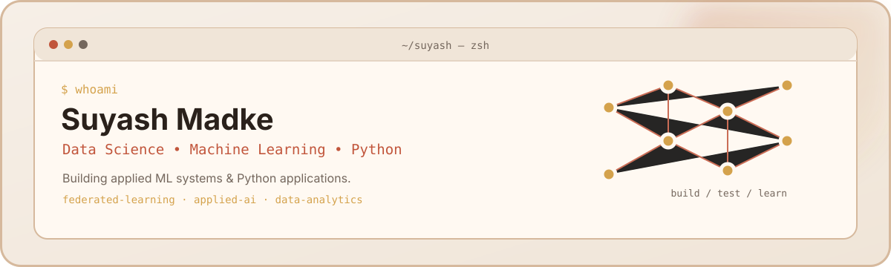

<picture>
  <source media="(prefers-color-scheme: dark)" srcset="dark.svg">
  <source media="(prefers-color-scheme: light)" srcset="light.svg">
  
</picture>

### `> whoami`

BSc Data Science student, University of Mumbai (2026). I build applied ML
systems and Python applications — most recently a federated learning model
for credit risk, alongside tools for learning, task, and finance tracking.

**Focus:** Data Science & Machine Learning · Python application development  
**Also comfortable with:** data analytics, applied AI / LLM integration

### `$ tech-stack`


### `$ featured-projects`

**[Federated Credit Risk Assessment](https://github.com/Samuel-025/federated-credit-risk-assessment)**  
Federated learning (FedAvg) system for loan-default prediction. Compared
against centralized baselines (Logistic Regression, Random Forest, Neural
Network); the federated model reached ~76.5% accuracy after 15 rounds,
compared with 78.2% for the strongest centralized baseline. Final-year
project, co-built as a two-person team. `Python · TensorFlow · scikit-learn`

**[YouTube Learning Tracker](https://github.com/Samuel-025/youtube-learning-tracker)**  
Local-first app + CLI to save YouTube videos, generate summaries, and track
learning progress. 233 passing tests, AI flashcards, exports to
Notion/Obsidian/Anki. `Python · Streamlit · CLI`

**[Daily AI Assistant](https://github.com/Samuel-025/daily_ai_assistant)**  
CLI + Streamlit assistant for tasks, habits, and journaling with
multi-provider LLM support. [Live demo](https://dailyaiassistant-bfszw6tsvquoaav2acjhuo.streamlit.app/)  
`Python · Streamlit · LLM APIs`

**[Personal Finance Tracker](https://github.com/Samuel-025/Personal-FinanceTracker)**  
FastAPI + SQLite backend, multi-currency web dashboard, PDF/Excel report
export. [Live demo](https://samuel-025.github.io/Personal-FinanceTracker/)  
`Python · FastAPI · SQLite`

### `$ cat education.txt`

BSc Data Science — University of Mumbai (2026)

### `$ cat current-focus.yaml`

```yaml
building:
  - Portfolio site (React + Vite)
learning:
  - Applied ML / federated learning
  - Data analytics (Tableau)
open_to:
  - Data Analytics / BI roles
  - Python / Data Science / Applied AI roles
```

### `$ connect`

[GitHub](https://github.com/Samuel-025) · [LinkedIn](https://linkedin.com/in/suyash-madke-775503314) · [Email](mailto:suyashmadke24@gmail.com)
